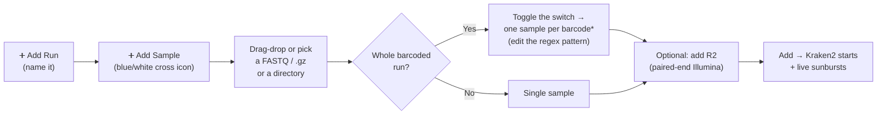
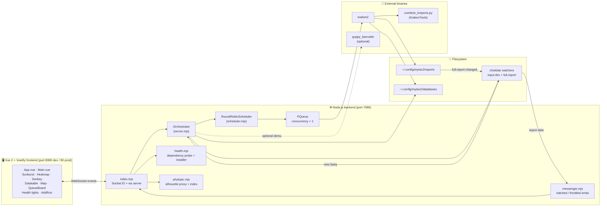
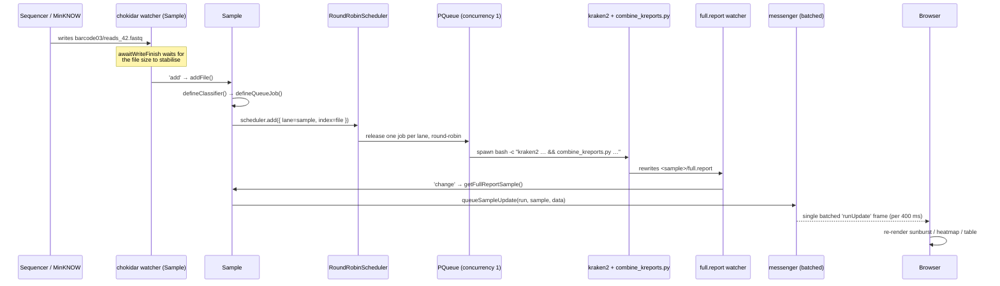
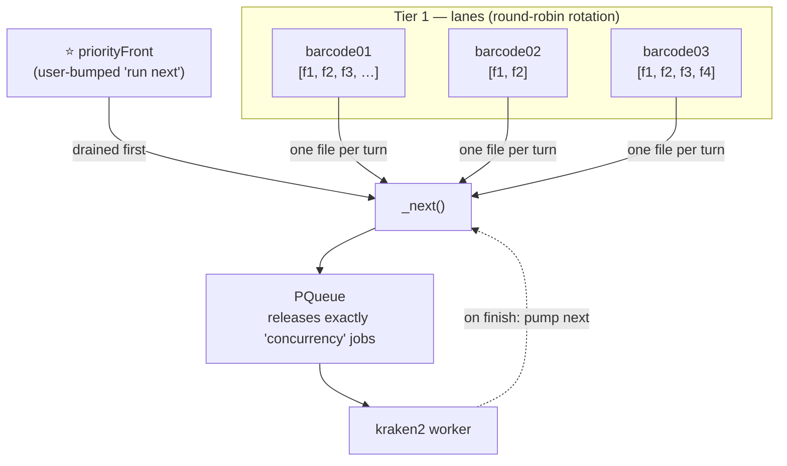
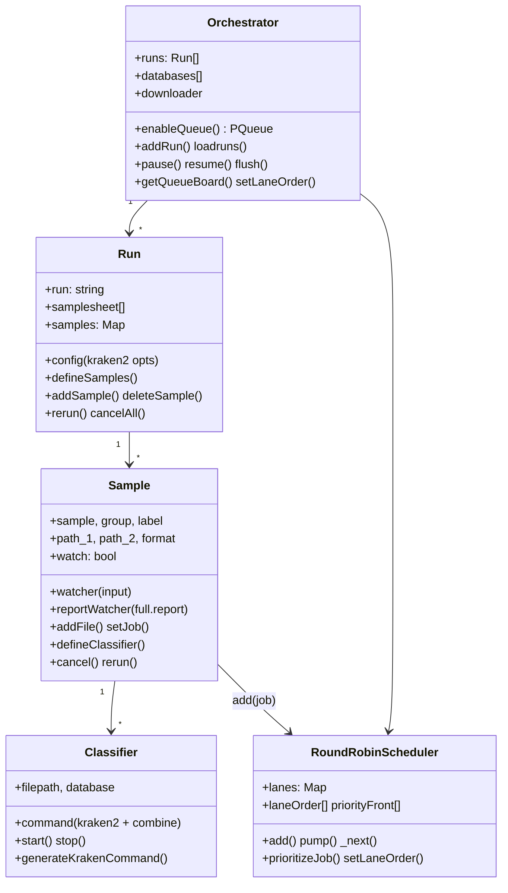
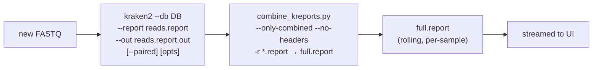

<div align="center">

# Mytax2 — Real-Time Metagenomic Reporting

**Watch Oxford Nanopore (and Illumina) FASTQ reads classify themselves _as they are sequenced_.**

Mytax2 watches your sequencing output directory, fires a Kraken2 classification job the moment each
FASTQ lands, merges the results into a per-sample report, and streams the live taxonomic breakdown to a
Vue.js dashboard over WebSockets — sunbursts, heatmaps, Sankey plots, and a geographic map, all updating
in real time.

</div>

---

## Table of contents

**Get started**

- [Requirements](#requirements)
- [Setup](#setup)
- [Running the app](#running-the-app)
- [Using the app (demo)](#using-the-app-demo)
- [The samplesheet](#the-samplesheet)
- [Kraken2 databases](#kraken2-databases)

**How it works**

- [What it does](#what-it-does)
- [Architecture at a glance](#architecture-at-a-glance)
- [How real-time classification flows](#how-real-time-classification-flows)
- [The job queue (two-tier round-robin scheduler)](#the-job-queue-two-tier-round-robin-scheduler)
- [Object model](#object-model)
- [Where Mytax2 stores things](#where-mytax2-stores-things)
- [The classification pipeline](#the-classification-pipeline)
- [The interface](#the-interface)

**Operate**

- [Deployment](#deployment)
- [PhyloPic taxon silhouettes](#phylopic-taxon-silhouettes)
- [Debugging](#debugging)
- [Project layout](#project-layout)
- [License and copyright](#license-and-copyright)

---

## Requirements

- **Conda** (Miniconda/Mambaforge) — used to create the environment and to install the bioinformatics
  tools. Mamba is used automatically if present (much faster solver).
- **Node.js 17+** — supplied by the conda environment (`nodejs=17.4.0`). The optional PhyloPic index
  rebuild script needs **Node 18+**.
- **Kraken2** and **KrakenTools** (`combine_kreports.py`) — the classification engine. Installed by the
  conda env, or one-click from the in-app **Backend dependencies** panel.
- *(Optional)* **guppy_barcoder** (Oxford Nanopore) for demultiplexing, and **dorado** for basecalling.
- *(Optional)* An **NVIDIA GPU + CUDA** for GPU-accelerated demux/basecalling (toggle "Enable GPU" in the
  top bar).

The app continuously probes for these and shows a cluster of **health lights** in the toolbar — green =
present, pulsing red = required-but-missing, amber = installing. Hover any light for the reason and a
one-click install (where the tool is conda-installable).

---

## Setup

### 1. Create the Conda environment

```bash
conda env create -f environment.yml
```

> ⚠️ On an Apple Silicon (arm64) Mac, force the x86_64 build so the bioinformatics binaries resolve:
>
> ```bash
> CONDA_SUBDIR=osx-64 conda env create -f environment.yml
> ```

### 2. Activate it

```bash
conda activate mytax2
```

### 3. Install the npm packages

```bash
npm install
```

That's it — the conda env brings Kraken2, KrakenTools, and Node; `npm install` brings the frontend and
backend JS dependencies.

---

### Updating the app

```
git pull && npm install
```

## Running the app

### Development (frontend + backend together)

```bash
conda activate mytax2
npm run serveBoth
```

This runs `npm run serve` (Vue dev server on **:8080**, hot-reload) **and** `npm run server`
(nodemon-watched backend on **:7689**) side by side. Open **http://localhost:8080**.

### Backend only

```bash
npm run server        # development (nodemon, NODE_ENV=development)
npm run production     # production (node server/index.mjs, NODE_ENV=production)
```

### Add another CORS origin for development

If you serve the frontend from another host/IP, allow it explicitly:

```bash
CORS_ADDR=192.168.55.1:7689 npm run serveBoth
```

### Build the production frontend bundle

```bash
npm run build          # outputs to ./dist
```

### Lint (development only)

```bash
npm run lint
```

| Command | What it does | Ports |
| --- | --- | --- |
| `npm run serveBoth` | Frontend dev server **and** backend, together | 8080 + 7689 |
| `npm run serve` | Frontend dev server only | 8080 |
| `npm run server` | Backend only (nodemon, dev) | 7689 |
| `npm run production` | Backend only (production) | 7689 |
| `npm run build` | Compile production frontend to `dist/` | — |
| `npm run build:phylopic` | Rebuild the PhyloPic silhouette index | — |

---

## Using the app (demo)

A demo samplesheet and example data ship under [`example-data/`](example-data) — three barcode folders
(`barcode01`, `barcode02`, `barcode03`), each with several `.fastq` files — so you can try the
barcoded-run workflow end to end without any sequencer.



1. Select **Add Run** and give it a name.
2. Click the **blue-and-white cross** icon on the left to add a sample. A run can hold many samples.
3. **Drag + drop** or select a FASTQ file (or its `.gz`) into the middle input. You can also point it at a
   **directory** of FASTQs. To analyze an **entire barcoded run**, toggle the switch — Mytax2 then matches
   every subdirectory of the input folder and makes **one sample per match**. Adjust the regex pattern
   field (default `barcode[0-9]+`) to control what counts as a barcode.
   - For the demo, point this at the `example-data/` directory and toggle the barcoded-run switch to get
     one sample per `barcode0X` folder.
4. *(Optional, paired-end)* add the **R2** file into the top-left input field.
5. Select **Add** — Mytax2 starts classifying with Kraken2 and renders the sunbursts in real time.

While a run is going you can **pause/resume** the whole queue, **cancel** or **rerun** individual files or
whole samples, **reorder** the barcode rotation, and **bump** any file to run next from the Queue Board.

> First run with no database yet? Pick one in the [Kraken2 database manager](#kraken2-databases) (the small
> `k2_viral` set is a fast first choice), and make sure the toolbar **health lights** for Kraken2 and
> KrakenTools are green before adding a sample.

---

## The samplesheet

Each run is backed by a samplesheet (you can also import a CSV). Columns:

| Column | Description |
| --- | --- |
| `sample` | Custom sample name. Identical across multiple sequencing libraries/runs from the same sample. Spaces are auto-converted to underscores (`_`). For barcoded runs, the parent run name is prefixed to each barcode (e.g. `RunA__barcode01`) so two runs with the same barcode numbers never collide. |
| `path_1` | Full path to the FASTQ for Illumina read 1 **or** ONT reads. May be a file or a directory. |
| `path_2` | Full path to the FASTQ for Illumina read 2 (paired-end only). |
| `format` | `file` or `directory`. As a UI toggle: when on, the entry auto-detects everything matching the regex pattern and makes **one sample per match** in that directory (e.g. `barcode01`, `barcode02`, …). |
| `pattern` | Regex used to match items for barcoded runs (optional; default `barcode[0-9]+`). |
| `classifier` | Classification engine for the sample: `kraken2` (default), `bracken` or `minimap2`. Chosen per-sample and editable/re-runnable afterwards. |
| `fastp` | `true`/`false` (default `false`). When on, [fastp](https://github.com/OpenGene/fastp) filters low-quality reads into `<sample>/fastp/…` before the classifier runs. |
| `minimapDatabase` | FASTA/MMI reference used when `classifier` is `minimap2` (a downloaded reference or any local file). |

### Per-sample classifiers and fastp

Every sample chooses its own **classifier** and whether to **pre-filter reads with fastp** in the
add/edit dialog (section _3 · Classifier_). Both are editable on an existing sample — change them and
hit **rerun** to re-classify with the new settings. All three engines are normalised to emit a
Kraken2-style `.report`, so the sunburst / Sankey / heatmap / map views keep working regardless of
which one you pick.

- **Kraken2** (default) — unchanged behaviour.
- **Bracken** — runs Kraken2 first, then Bracken re-estimates abundances and writes a fresh
  Kraken2-style report. Requires a **Bracken-built database** (the `databaseXXmers.kmer_distrib` files);
  if they're missing, Mytax2 logs a warning and falls back to the raw Kraken2 report so the run still
  completes.
- **minimap2** — aligns reads to a FASTA/MMI reference (`map-ont` preset for ONT, `sr` for Illumina)
  and produces a sorted, indexed **BAM** (via `samtools`) as the durable per-file alignment output,
  then converts it to a Kraken2-style report. Provide a `seqid2taxid.map` (two columns:
  `seqid<TAB>taxid`) next to the reference to get real NCBI taxids; otherwise deterministic synthetic
  ids are used so the same reference merges consistently across files. When an NCBI **taxdump**
  (`nodes.dmp`/`names.dmp`) is available, the converter builds the **full lineage** so the
  hierarchy/heatmap/sunburst views populate (root → domain → … → species) instead of a flat list.
  The reference index (`<ref>.<preset>.mmi`) and per-reference lineages (`<ref>.lineage.json`) are
  cached on first use so subsequent files are fast.

  Taxdump is discovered next to the reference, in a `taxonomy/` or `taxdump/` subfolder beside it, or
  in `~/.config/mytax2/databases/taxdump/`. It can be auto-pulled from the in-app **Databases** panel
  (`ncbi_taxdump`), the same way as the kraken2 sets.

`fastp`, `minimap2` and `bracken` are installed by the Conda environment and also appear in the in-app
**Backend dependencies** panel for one-click install.

---

## Kraken2 databases

Mytax2 ships a built-in **download manager** for common Kraken2 databases. Pick one in the UI and it
streams + extracts to `~/.config/mytax2/databases/` with a live progress bar; re-downloads ask for
confirmation before overwriting. Available out of the box:

| Key | Database |
| --- | --- |
| `k2_viral_20231009`, `k2_viral_20250714` | Kraken2 viral |
| `flukraken2` | Influenza (FluKraken2) |
| `MarineMitogenome20210629` | Marine mammal mitochondrion (RefSeq) |
| `pluspf8` | Kraken2 PlusPFP 8 GB |
| `Greengenes13.5`, `SILVA132`, `SILVA138`, `RDP11.5` | 16S rRNA reference sets |

You can also use any Kraken2 database you already have on disk. Nested index layouts (e.g. the 16S
Silva/RDP sets that extract into a `<name>_k2db` subfolder) are resolved automatically to the directory
that actually contains `hash.k2d` / `taxo.k2d`.

### minimap2 references

`minimap2`-classified samples align against a **FASTA/MMI reference** rather than a Kraken2 index. These
are single files (optionally gzipped — minimap2 reads `.gz` directly), so the download manager pulls
them to `~/.config/mytax2/databases/` **without extracting** them. One reference ships out of the box
(`minimap2_refseq_viral`, NCBI RefSeq viral genomes); add more entries to the `databases` array in
`server/server.mjs` with `type: 'minimap2'` and `decompress: false`, or just point a sample at any local
FASTA/MMI via the custom-path field. To get real NCBI taxids in the report, place a `seqid2taxid.map`
next to the reference file.

To fetch the classic MiniKraken2 database manually:

```bash
mkdir -p data/databases
wget ftp://ftp.ccb.jhu.edu/pub/data/kraken2_dbs/old/minikraken2_v2_8GB_201904.tgz \
  -O ./data/databases/minikraken2.tar.gz
tar -xvzf ./data/databases/minikraken2.tar.gz && rm -rf data/databases/minikraken2.tar.gz
mv minikraken2_v2_8GB_201904_UPDATE data/databases/
```

---

## What it does

Mytax2 is a desktop/lab tool for **live metagenomic surveillance**. Point it at a run folder (e.g. the
MinKNOW output directory), and as each `.fastq` / `.fastq.gz` file is written it will:

1. **Detect** the new file via a filesystem watcher (debounced so half-written files are never queued).
2. **Queue** a Kraken2 job through a fair, two-tier round-robin scheduler so every barcode starts showing
   results quickly instead of draining barcode01 before barcode02 begins.
3. **Classify** the reads with Kraken2 against a database you choose.
4. **Merge** the per-file Kraken report into a rolling `full.report` for the sample with KrakenTools'
   `combine_kreports.py`.
5. **Stream** the updated report to the browser, where it renders as an interactive sunburst, heatmap,
   Sankey diagram, sortable table, and map — all without a page refresh.

It supports **single-file samples**, **directories of FASTQs**, **whole barcoded runs** (auto-expanding a
parent folder into one sample per `barcode*` subdirectory via a regex pattern), **paired-end Illumina**
reads, and optional **ONT demultiplexing** with `guppy_barcoder`.

---

## Architecture at a glance

Mytax2 is two processes that talk over a Socket.IO WebSocket: a **Vue 2 / Vuetify** single-page frontend
and a **Node.js (Express + Socket.IO)** backend that owns all watching, queueing, and classification.



**Key building blocks**

| Layer | File(s) | Responsibility |
| --- | --- | --- |
| WebSocket server | `server/index.mjs` | Socket.IO connection handling, every client event handler, PhyloPic HTTP routes. |
| Orchestrator | `server/server.mjs` | Owns runs, databases, the PQueue, config, pause/resume, download manager. |
| Round-robin scheduler | `server/scheduler.mjs` | Fair, reorderable two-tier job ordering in front of the PQueue. |
| Run | `server/run.mjs` | One named run; holds its samplesheet and `Sample` objects; persists to JSON. |
| Sample | `server/sample.mjs` | One sample/barcode; watches its input, spawns classify jobs, watches its `full.report`. |
| Classifier | `server/classifier.mjs` | Builds + runs the `kraken2` + `combine_kreports.py` command for a single FASTQ. |
| Barcoder | `server/barcoder.mjs` | Optional `guppy_barcoder` demultiplexing for ONT directories. |
| Messenger | `server/messenger.mjs` | Coalesced, run-scoped, throttled WebSocket broadcasting. |
| Health | `server/health.mjs` | Probes `kraken2`/`KrakenTools`/`conda`/`dorado`/`guppy`; one-click conda installs. |
| Downloader | `server/downloader.mjs` | Streams + extracts Kraken2 databases with live progress. |

---

## How real-time classification flows

What happens between dropping a FASTQ into a watched folder and seeing the sunburst update:



Two filesystem watchers per sample do the work (both `chokidar`, both using `awaitWriteFinish` so they
fire **once per finished file**, never on a partial write):

- **Input watcher** — watches the sample's `path_1` for new `*.fastq(.gz)` / `*.fq(.gz)` / `*.fa[sta]`
  files. Each new file becomes a classify job. With `watch: true` (default) it keeps listening for new
  reads in real time; with `watch: false` it does a single pass over existing files and then closes.
- **Report watcher** — watches `<outputdir>/<sample>/full.report`. Whenever Kraken's merged report is
  rewritten, the new content is pushed to whichever clients are viewing that run.

> **Why the batching matters:** a dense run can produce thousands of FASTQs. Emitting a frame per job
> would saturate the socket and cause the "connection lost then regained" symptom. Mytax2 instead
> **coalesces** updates per sample/job and flushes **one `runUpdate` frame per run every ~400 ms**, only
> to clients actually viewing that run. Socket.IO is also tuned for bursts: `maxHttpBufferSize` 100 MB,
> `pingTimeout` 60 s, `pingInterval` 25 s, and per-message deflate above 1 KB.

---

## The job queue (two-tier round-robin scheduler)

The naive approach pushes every sample's files straight onto a single FIFO queue, so a 24-barcode run
would classify **all** of barcode01 before touching barcode02. Mytax2 inserts a **round-robin scheduler**
(`server/scheduler.mjs`) in front of the PQueue to keep things fair and reorderable:



- **Tier 1** decides *which* lane (barcode/sample) goes next, cycled round-robin so later barcodes start
  appearing almost immediately. Play order: `bc01·f1 → bc02·f1 → bc03·f1 → bc01·f2 → …`. Lanes that run
  out are skipped on their turn but keep listening, so files dropped in later slot back into the rotation.
- **Tier 2** is the ordered list of FASTQ files inside each lane (kept in read order by file index).
- A **priority front** holds jobs the user explicitly bumped to *run next*; it's drained before the
  rotation.
- The scheduler releases exactly `concurrency` jobs (matching the PQueue, default **1**), so the existing
  per-job abort/status logic is untouched — the scheduler only controls **ordering**.

This ordering is **live and reorderable** from the **Queue Board** UI:

| Action | WebSocket event | Scheduler method |
| --- | --- | --- |
| Reorder the barcode rotation (drag lanes) | `setLaneOrder` | `setLaneOrder(run, samples)` |
| Bump one file to run next | `prioritizeJob` | `prioritizeJob(run, sample, index)` |
| Read the current play order | `getQueueBoard` | `getBoard(run)` |
| Cancel / rerun / pause / resume / flush | `cancel` · `rerun` · `pause` · `flush` | via `Orchestrator` → `Sample` |

---

## Object model



---

## Where Mytax2 stores things

All persistent state lives under `~/.config/mytax2/`:

```
~/.config/mytax2/
├── config.json          # global config (savePath, watch paths)
├── runs/                # one <run>.json per run (samplesheet + kraken2 config)
├── users/               # <userId>.json per-client settings (db, gpu, watchpath)
├── databases/           # downloaded Kraken2 databases
└── reports/             # per-run output
    └── <run>/
        └── <sample>/
            ├── reads_1.report      # per-file Kraken report
            ├── reads_1.report.out  # per-file Kraken assignments
            └── full.report         # merged, rolling report (what the UI reads)
```

The default ONT watch path is `/var/lib/minknow/data`. Runs are auto-loaded on startup from `runs/`.

---

## The classification pipeline

For each FASTQ, the `Classifier` builds and runs a single shell command (see `server/classifier.mjs` and
`server/src/bundle.sh`):



- `kraken2` runs against the selected database, writing a per-file `.report` and `.out`.
- `combine_kreports.py` (KrakenTools) merges **all** of the sample's per-file reports into one
  `full.report` — that's the rolling, cumulative view the dashboard renders.
- **Kraken2 options** are configurable per run (defaults shown):

  | Option | Default | Option | Default |
  | --- | --- | --- | --- |
  | `memory-mapping` | `true` | `report-zero-counts` | `false` |
  | `gzip-compressed` | `false` | `quick` | `false` |
  | `bzip2-compressed` | `false` | `threads` | `1` |
  | `minimum-hit-groups` | `false` | `confidence` | `0` |
  | `report-minimizer-data` | `false` | `minimum-base-quality` | `0` |

- Jobs are **abortable mid-run**: classifiers spawn detached (their own process group) so cancelling kills
  the whole `kraken2` process tree immediately rather than waiting for it to finish loading the DB.
- **ONT demultiplexing** (`server/barcoder.mjs`) is optional: it stages an input file, runs
  `guppy_barcoder --compress_fastq`, and copies each `barcode*` output into a per-barcode directory that
  then becomes its own sample. GPU (`-x cuda:0`) is used when "Enable GPU" is on.

---

## The interface

The frontend (`src/`) is a Vue 2 + Vuetify SPA. The left panel manages runs/samples; the main area is a
set of visualization tabs, each driven by the live `full.report` stream.

| Component | Tab / role |
| --- | --- |
| `Sunburst.vue` | Interactive D3 sunburst of the taxonomic hierarchy (the headline real-time view). |
| `Heatmap.vue` | Abundance heatmap across samples. |
| `Sankey.vue` | Taxonomic flow / Sankey diagram. |
| `Datatable.vue` / `DataTableTab.vue` | Sortable, paginated classification table; top hits. |
| `Explore.vue` | Multi-sunburst explorer (zoom many samples at once, reset all). |
| `Map.vue` + `Metadata.vue` | Leaflet map of samples by lat/long, with a metadata editor. |
| `Plates.vue` | Plate/well layout view. |
| `CrossSample.vue` | Cross-sample comparison. |
| `RunStats.vue` / `SampleStats.vue` | Run- and sample-level summary stats. |
| `QueueBoard.vue` | Live queue board — drag to reorder lanes, bump jobs to run next. |
| `Gosling.vue` | HiGlass/Gosling genomic view. |
| `PhyloPicIcon.vue` | Taxon silhouettes next to names. |
| `AddRun.vue` / `Samplesheet.vue` / `DropZone.vue` / `Barcoding.vue` | Run creation, samplesheet editing, drag-drop input, demux controls. |

The top bar carries the **GPU toggle** and the **backend dependency health lights** described above.

> 📸 **Screenshots:** add UI captures to a `docs/screenshots/` folder and reference them here (e.g.
> ``) — the live sunburst, the Queue Board, and the Map are the
> most useful to show.

---

## Deployment

### A. Development / lab workstation

`npm run serveBoth` (above) is the simplest setup. Open `http://localhost:8080`.

### B. systemd service

A unit file (`mytax2.service`) is provided for always-on hosts:

```ini
[Unit]
Description=MyTax Service
After=network.target

[Service]
Type=simple
User=minion
WorkingDirectory=/home/minion/mytax
ExecStart=/bin/bash -c '/home/minion/miniconda3/bin/activate && npm run serveBoth'
Environment="PATH=/home/minion/miniconda3/bin:/usr/bin:/bin"
Restart=on-failure

[Install]
WantedBy=multi-user.target
```

Adjust the paths/user, then `sudo systemctl enable --now mytax2` and check it with
`sudo service mytax2 status`.

### C. Docker

The `Dockerfile` builds the production frontend and serves it with nginx; it also bundles Kraken2,
KrakenTools, and guppy_barcoder (CPU + GPU) on a CUDA base image.

```bash
conda activate mytax2
npm run build
docker build . -t jhuaplbio/basestack_mytax2
```

Run the container, exposing nginx on host port **8098**:

```bash
docker container run -it --rm -p 8098:80 jhuaplbio/basestack_mytax2 bash -c "nginx; bash"
```

> **Note:** nginx serves the static UI; for live classification the Node backend (port **7689**) must also
> be running and reachable (e.g. `npm run production` inside the container or as a sidecar), with the
> frontend's WebSocket origin allowed via `CORS_ADDR`.

---

## PhyloPic taxon silhouettes

Taxon silhouettes are resolved in the frontend from a prebuilt index committed under
`src/assets/` (the bundled index is `phylopic_image_index.json`; the rebuild script writes
`phylopic-index.json` by default — point `--out` at the file your build imports). No per-load API
fan-out is needed. Each taxon title maps to
`{ sourceFile, vectorFile, thumbnail, source }`; the app renders the clean SVG `vectorFile` first, falling
back to `sourceFile`, then the PNG `thumbnail`. The backend also exposes `/phylopic/index` and a
CORS/SSRF-guarded `/phylopic/svg` proxy so silhouettes load without browser CORS issues.

Rebuild the index whenever PhyloPic publishes a new `build` number:

```bash
npm run build:phylopic
# or: node scripts/build-phylopic-index.mjs
```

This pages all of PhyloPic and overwrites the index. By default it keeps every title; restrict to real
NCBI taxa with `--filter --names /path/to/names.dmp` (override matched classes with
`--classes "<comma,list>"`). Other options: `--out <path>`, `--concurrency <n>`. Requires **Node 18+** and
network access to `api.phylopic.org` (only this build step needs it).

---

## Debugging

Depending on how you deployed:

1. **systemd:** `sudo service mytax2 status` for service state, `journalctl -u mytax2 -f` for logs.
2. **Dev mode:** watch the terminal running `npm run serveBoth` / `npm run server`. Backend logs also go to
   `logs/` and stream into the UI's log panel over the socket.
3. **Docker:** `docker container logs <container_name>`.
4. **Backend dependencies:** open the health panel (the cluster of lights in the top bar) — it tells you
   exactly which tool is missing, its resolved path/version, and offers a one-click install.

---

## Project layout

```
mytax/
├── server/                  # Node.js backend
│   ├── index.mjs            # Socket.IO server + all event handlers + PhyloPic routes
│   ├── server.mjs           # Orchestrator (runs, DBs, PQueue, config, pause/resume)
│   ├── scheduler.mjs        # Two-tier round-robin job scheduler
│   ├── run.mjs              # Run model (samplesheet + samples, persisted to JSON)
│   ├── sample.mjs           # Sample model (input + report watchers, job creation)
│   ├── classifier.mjs       # kraken2 + combine_kreports command builder/runner
│   ├── barcoder.mjs         # guppy_barcoder demultiplexing
│   ├── messenger.mjs        # batched / throttled / run-scoped WebSocket emits
│   ├── health.mjs           # dependency probe + in-UI conda installer
│   ├── downloader.mjs       # Kraken2 database downloader (progress streaming)
│   ├── controllers.mjs      # path search, sample-id helpers, kraken config defaults
│   ├── queue.mjs · storage.mjs · logger.js
│   └── src/                 # bundle.sh + pipeline shell/python helpers
├── src/                     # Vue 2 + Vuetify frontend (components, assets, services)
├── example-data/            # demo barcoded FASTQs + samplesheet
├── databases/               # bundled small DBs (flukraken2, mpox, HRSV, marine mito)
├── scripts/                 # build-phylopic-index.mjs
├── Dockerfile · nginx.conf · mytax2.service
├── environment.yml          # conda env (kraken2, krakentools, node, python, …)
└── package.json · vue.config.js
```

---

## License and copyright

Copyright (c) 2019 Thomas Mehoke · Johns Hopkins University Applied Physics Laboratory.

This program is free software: you can redistribute it and/or modify it under the terms of the **GNU Affero
General Public License** as published by the Free Software Foundation, either version 3 of the License, or
(at your option) any later version.

This program is distributed in the hope that it will be useful, but **WITHOUT ANY WARRANTY**; without even
the implied warranty of MERCHANTABILITY or FITNESS FOR A PARTICULAR PURPOSE. See the GNU Affero General
Public License for more details.

You should have received a copy of the GNU Affero General Public License along with this program. If not,
see <https://www.gnu.org/licenses/>.
